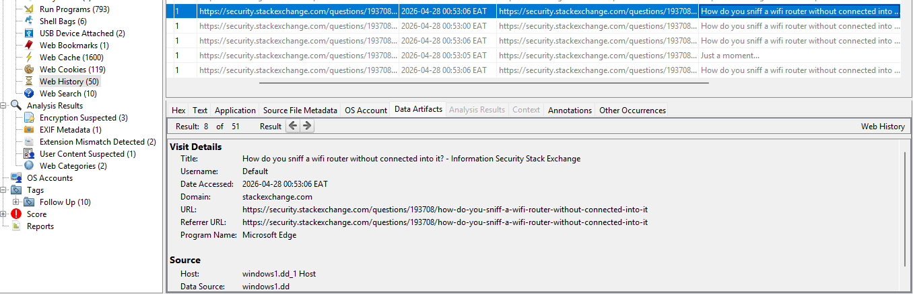
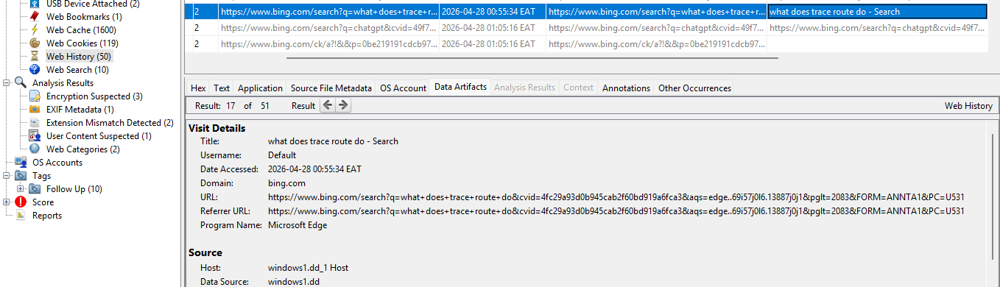
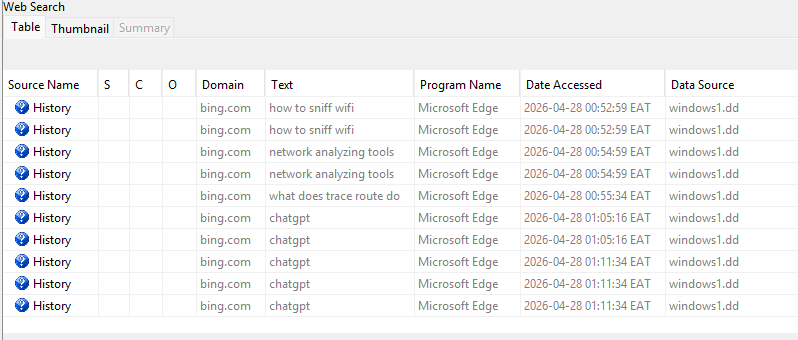
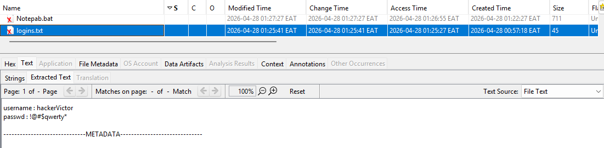
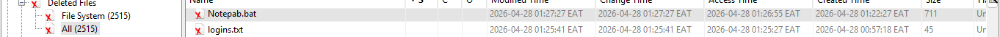
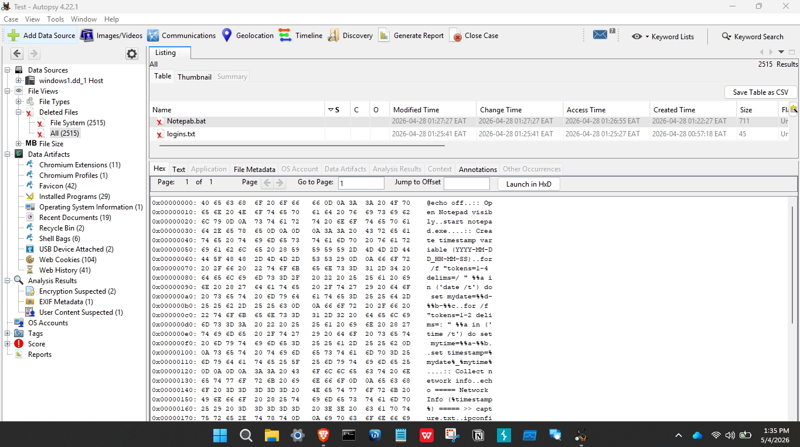
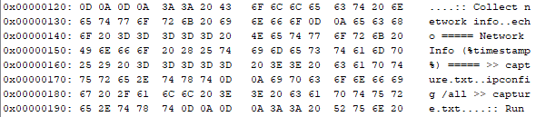
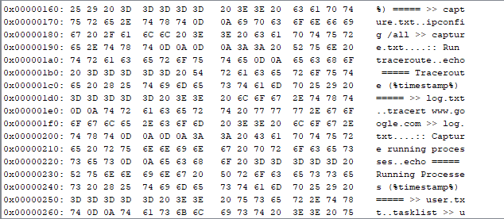

User accessed web search queries related to WiFi sniffing between 00:53 and 00:54.

A file named "login.txt" was created at 00:57, containing sensitive information such as usernames and passwords.

A batch script named "notepab.bat" was created at 01:22.

The script was designed to appear legitimate by opening Notepad while executing hidden commands in the background.

The script collects system network configuration using ipconfig and stores the output in "capture.txt".

The script executes a traceroute command to an external server and logs the results in "log.txt".

The script captures running processes using tasklist and saves the output in "user.txt".

The file "login.txt" was deleted at 01:25, indicating possible attempt to remove sensitive evidence.

A compressed archive (ZIP file) was created at 01:26, suggesting data collection or packaging activity.

A folder named "hacks" was deleted at 01:27, indicating cleanup or concealment of activity.

Multiple output files including "capture.txt", "log.txt", and "user.txt" were created at 01:28.

The generated files contain network details, traceroute paths, and running system processes, indicating system reconnaissance activity.

A ZIP folder was created at 01:28, likely used to group collected data for storage or exfiltration.

The sequence of events indicates that the user executed a disguised script to collect system and network information, followed by partial cleanup and data packaging.
